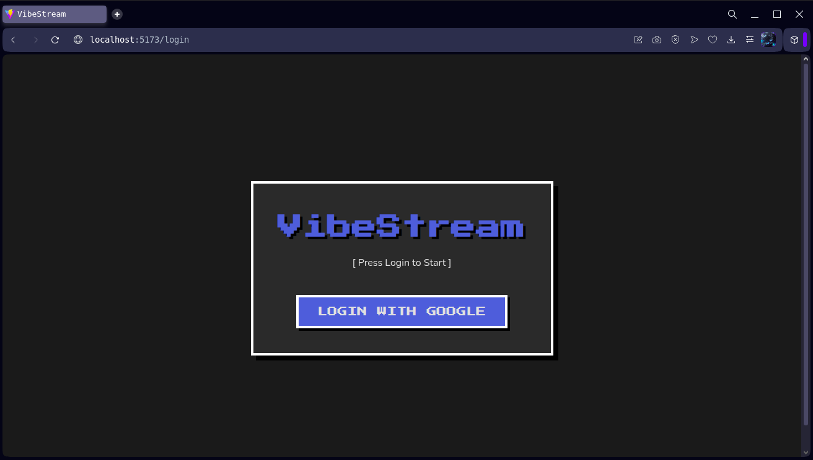
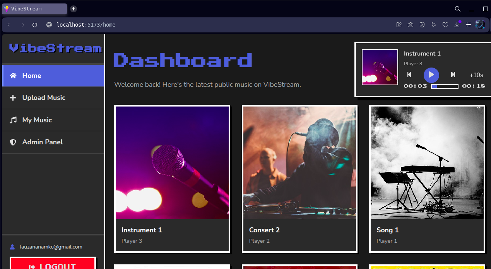
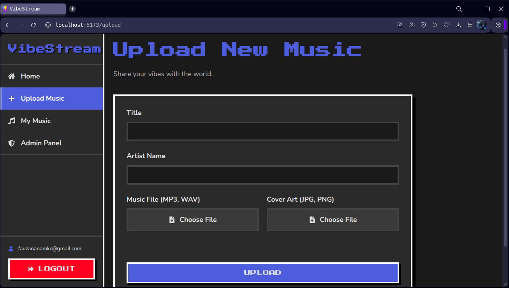

# 🎵 VibeStream

[](https://opensource.org/licenses/MIT)
[](https://www.python.org/)
[](https://reactjs.org/)
[](https://fastapi.tiangolo.com/)

VibeStream is a modern, open-source music streaming web application with a unique retro-pixel aesthetic. It allows users to upload their own music, create public or private playlists, and enjoy a seamless listening experience with a persistent, floating music player. The project is built with a powerful Python backend and a dynamic React frontend.

## 📸 Screenshots

| Login Page                               | Main Dashboard                             | Upload Page                                |
| :---------------------------------------: | :----------------------------------------: | :----------------------------------------: |
|  |  |  |

## ✨ Key Features

*   **Google OAuth Authentication**: Secure and easy login for users.
*   **Multi-Role User System**:
    *   **User**: Can upload music, create public/private playlists.
    *   **Admin**: Helps moderate public content.
    *   **Owner**: Has full control, including user role management.
*   **Music & Cover Art Upload**: Users can upload their own audio files and cover art.
*   **Dynamic Playlist System**: Full-featured playlist creation with `public` and `private` visibility settings. Playlist covers are automatically generated from the first song added.
*   **Floating "VibeDeck" Player**: A persistent, feature-rich player that continues playback across pages, complete with progress bar, next/previous, and skip controls.
*   **Secure Admin Panel**: An exclusive panel for the `owner` to manage user roles.
*   **Modern-Retro UI**: A unique user interface that blends modern layout principles with pixel-perfect fonts and retro-style elements.
*   **Interactive Experience**: User-friendly toast notifications and real-time sound effects (generated via Web Audio API) for a more engaging experience.

## 🛠️ Technology Stack

| Area      | Technology                                                                                                  |
| :-------- | :---------------------------------------------------------------------------------------------------------- |
| **Frontend**  | **React.js**, **Vite**, **Zustand** (State Management), **React Router**, **Axios**, **react-hot-toast**, **CSS3** |
| **Backend**   | **Python**, **FastAPI** (Web Framework), **Uvicorn** (ASGI Server)                                              |
| **Database & Services** | **Supabase** (PostgreSQL Database, Authentication, Storage), **Row Level Security (RLS)**             |

## 🚀 Getting Started

Follow these instructions to get a local copy of VibeStream up and running for development.

### Prerequisites

*   **Node.js** (v18 or newer) and **npm**
*   **Python** (v3.11 or newer)
*   A free **Supabase** account
*   A **Google Cloud Platform** account to set up OAuth credentials

### Installation & Setup

1.  **Clone the Repository**
    ```bash
    git clone https://github.com/Fauzananam/vibestream.git
    cd vibestream
    ```

2.  **Setup Supabase**
    *   Create a new project on [Supabase](https://supabase.com/).
    *   Navigate to the **SQL Editor** and run the master setup script located at `vibestreamsupabase.sql` to create all tables, triggers, and security policies.
    *   Navigate to **Storage** and create a new **public** bucket named `vibe-storage`. Ensure you set up the access policies as defined in the SQL script.

3.  **Setup Google OAuth**
    *   Follow the official Supabase guide for setting up [Google OAuth](https://supabase.com/docs/guides/auth/social-login/google).
    *   Copy your **Client ID** and **Client Secret** and add them to the Google provider settings in your Supabase dashboard.

4.  **Configure Environment Variables**
    *   Copy `.env.example` to `.env` in the `backend/` folder and fill in your Supabase credentials.
    *   Copy `.env.local.example` to `.env.local` in the `frontend/` folder and fill in your Supabase credentials.

5.  **Run the Project Setup Script**
    This script will create a Python virtual environment and install all required backend and frontend dependencies.
    ```bash
    chmod +x startproject.sh
    ./startproject.sh
    ```

6.  **Set Your Role to Owner**
    To access the Admin Panel, you must manually set your role after signing up.
    *   Sign up for your application using Google login.
    *   Go to your Supabase **Table Editor**, open the `profiles` table.
    *   Find your user row and change the value in the `role` column from `user` to `owner`.

7.  **Run the Development Servers**
    ```bash
    chmod +x startdev.sh
    ./startdev.sh
    ```
    *   Backend: `http://127.0.0.1:8000`
    *   Frontend: `http://localhost:5173`

## 📜 License & Disclaimers

This project is licensed under the MIT License. See the [LICENSE](LICENSE) file for more details.

### Credit & Attribution

You are free to use, modify, and distribute this software. However, if you use a substantial portion of this project's source code for your own works, **crediting the original author is kindly requested.** Please include a link back to this repository.

### ⚠️ Music Content Disclaimer

The owner and contributors of the VibeStream project **do not claim any ownership or credit for the audio content uploaded to the platform** by its users. All responsibility for the uploaded content, including copyright and licensing, lies solely with the user who uploads it. This project is provided as an open-source template and is not responsible for how it is used or the content managed by it.

## ✍️ Author

*   **Fauzananam** - *Initial work & Project Lead* - [Fauzananam](https://github.com/Fauzananam)